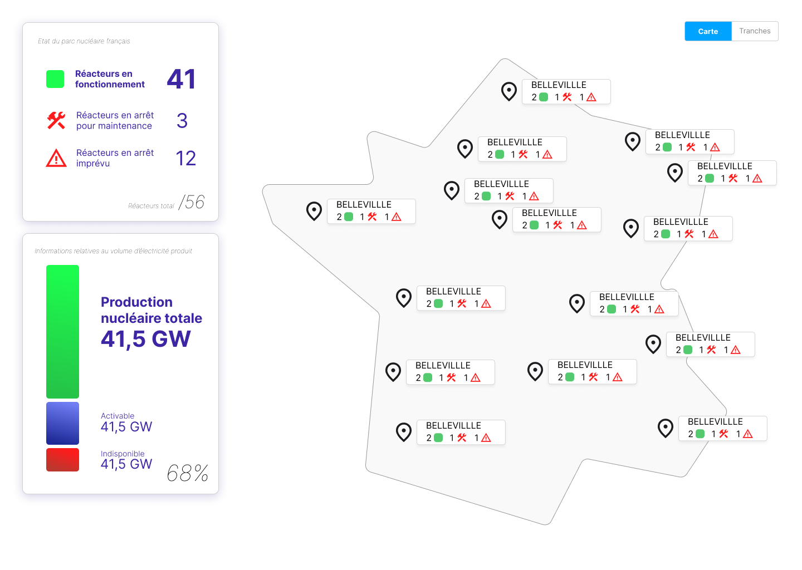

# Push_Nuke
## Introduction
A partir d'une source de donnée RTE du catalogue de données identifiant les moyens de productions disponibles, RTE souhaiterait communiquer aux français de façon automatique les indisponibilités des moyens de production sur une carte de France.
Il est nécessaire d'afficher sur une carte de France, ceux qui sont disponibles ou indisponibles visuellement.

